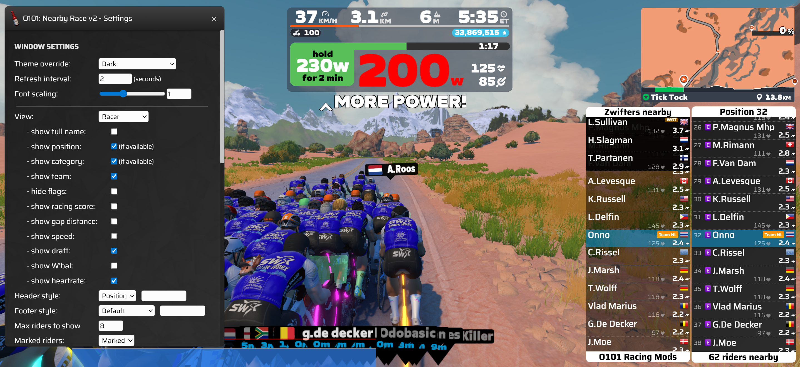
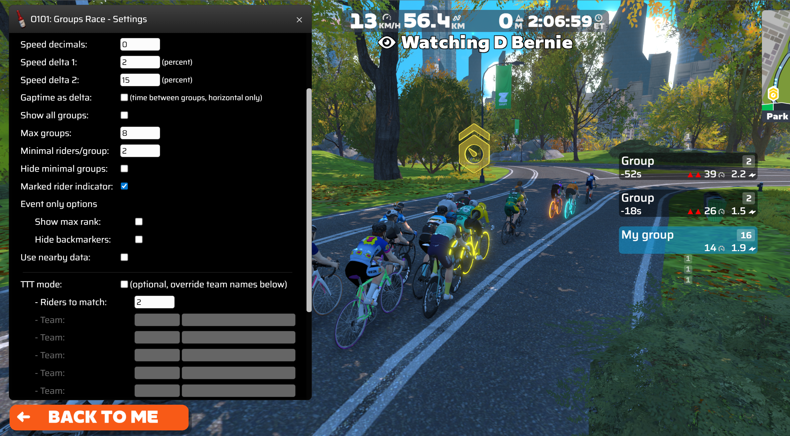
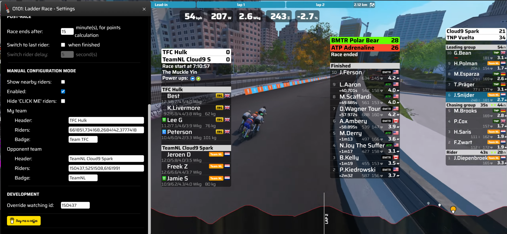
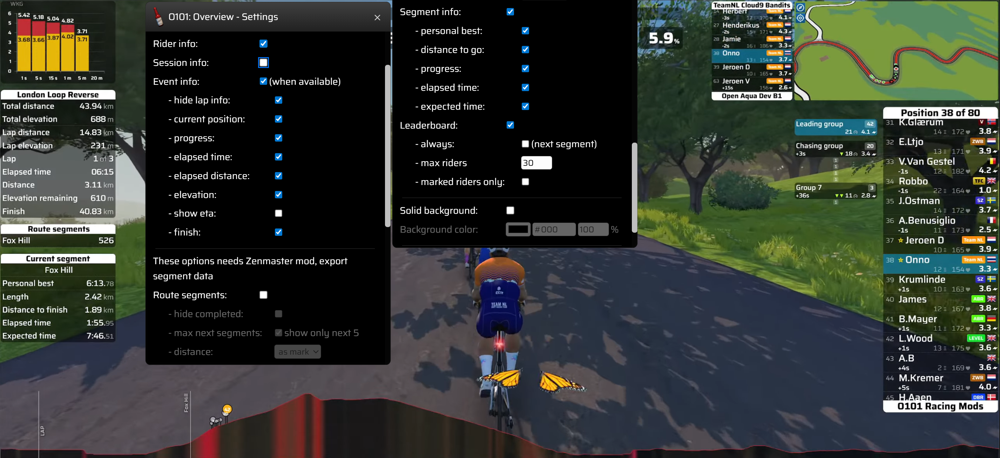
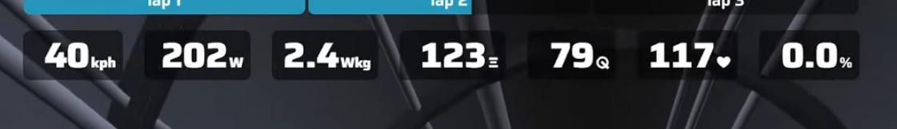
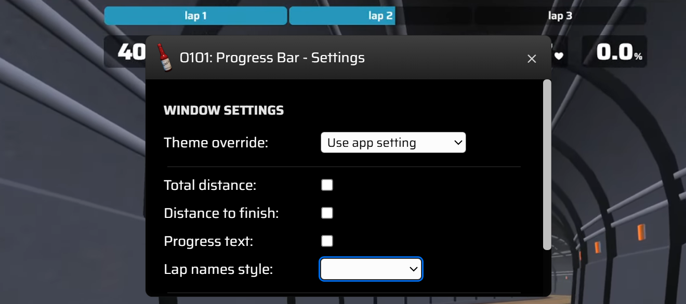

# [O101 racing MODS](#O101-racing-MODS), for Sauce for Zwift™
- [Nearby Race v2](#nearby-race-v2)
- [Groups Race](#groups-race)
- [Ladder Race](#ladder-race)
- [Overview](#overview)
- [Livedata](#livedata)
- [Progress Bar](#progress-bar)
- [Fan Viewer](#fan-viewer)

## Nearby Race v2

The nearby race v2 mod window is the default Zwift nearby riders on steroids. You can overlay the default Zwift nearby window or in no-HUD have it on your desired position.

It has a lot of options so you can tailor it to your needs. Best is to find out yourself. Fan viewing a pace partner or a race and try out what each option does.

To have a quick start, I'll explain some options, skipping those that are or should be self-explaining.

**Rider names**: These are filtered to have clean names. It can be different from default Zwift nearby.

**Wkg**: At the right side you can see the Wkg a rider is pushing. Default text color is white. It's colored when power is above a certain amount.
- 5 Wkg => orange
- 8 Wkg => red
- 11 Wkg => purple

**Power ups**: For sauce, there's no information available which power up can be deployed. Once it's active, it will show the active power up icon in front of the name. The background progresses from full to zero indicating how much power up left.

**View**: Choose this one to start. I only race, so most options are related for racing.

**Show position**: Displays position in front of the name. Position is as known at Zwift servers, so can differ to default Zwift nearby.

**Show team**: Shows team name as a badge next to the name. Team name is derived from the Zwift name. For example, my Zwift name "O. Aphinan (CLOUD)" will be translated into O.Aphinan and a nice colored team badge named CLOUD. Some most used teams have predefined colors. If you want your team have the right color, let me know.

**Max riders to show**: The number of riders to show in the nearby list. 4 means 2x4 riders and having you centered if possible. It can also be 8 and you at the back. For low end hardware don't use more than needed.

**Marked riders**: "Marked" will have the marked rider visible with a star icon in front and different background. They will only show if nearby close to your position. "Sticky" will have the marked riders always visible. It can be on top, or at the bottom of the nearby window. "Only" will filter out all other riders, also no star icon or different background.

**Show robopacers/leader/sweaper**: Have them always visible / sticky on top or bottom of the nearby window. Same as sticky marked riders. Great for group rides or robopacer rides to know where they are.

**My category only**: Filters out other start pens.

**Refresh on attack**: Having a fast refresh interval changes the nearby riders a lot. You can have that one refreshing slow. But you want to know when someone attacks or starts sprinting at the finish. You can use this setting, and it will update the nearby riders as soon as there's new data available. Asap can vary between 400ms or 1500ms, depends on the Sauce framework.

**Name overrides**: For team racing or something else (whatever you can think of) Some teammates can't type, resulting in a messy name and or different team badge. Lookup their Zwift id and override name and team badge.

**Flamme Rouge Racing**: For the FRR races the category is mandatory, FHRC badge. To easily see a rider's FHRC badge you can use this. As all FHRC badges have a reddish colour, you can customize your own category badge and easily distinguish it.

**Tips & Tricks**
- You can have multiple Nearby Race v2 windows. For example, the default and next to that a window of your teammates and/or rivals. Also great for mixed cat or FRR races, see all nearby and your own category.
- You can zoom in or out using ctrl and + or - keys.
- For TTT's use marked riders only and name overrides with number prefix. The name override function has a add to / remove from marked riders button.

## Groups Race

The groups race window give you more insights whats happening around you.

- Time on the left, the gap between the group and your group.
- Wkg on the right, the avg Wkg of riders in front. Riders in front are those without draft and a higer power average than the front of the pack. It can show you if the pack is stretching or backing of at an early stage.
- Leading group / leader and chasing group / chaser are always visible, if in the data stream.

**Speed delta**: a visual indicator of groups compared to your group speed.
- double green, your group is way faster (speed delta 2)
- single green, your group group is faster (speed delta 1)
- no indicator, almost equal speed
- single red, group is faster than you (speed delta 1)
- double red, group is way faster than you (speed delta 2)

**Minimal riders/group**: You can minimize small groups if you want to. Or even hide them.

**Show max rank**: For scratch or points races, it shows the best possible position of the group, when you win the group sprint.

**Use nearby data**: Grouping based on draft and minimal time. A new group is a gap more than 1 sec AND the next rider has no draft. It shows you minimal gaps and you can act on it in front.

**TTT mode**: It shows a team badge instead of the group name. The team badge is based on the amount (most) of team riders. Easy TTT mode is just enabling it. If you want more control and override a team badge, you can create rules. Add the desired team name in the first fiel. Second field should be the Zwift IDs of the riders, comma separated.

## Ladder Race

The ladder race window is made for... LADDER RACING! A great 5 vs 5 tactical racing format. The screenshot shows multiple states. Left is pre-race, middle is post-race and right is live.

The ladder info is based on the current watching rider. So if you're scheduled for a race, you will see the race info. The watching rider can be overridden by Zwift ID at the bottom of the configuration page. If no data loads, there's no race available today for the watching rider (ladder site queries by today, will be changed to now+24h in the future)

The ladder windows has some characteristics of my nearby race v2 and groups race mod.

Only riders registered for the race will be shown. Check manual configuration to fix some things.

If not needed, do NOT refresh the ladder window. It resets some configuration values.

**Scoring calculation**: Default is current race positions. When using optimistic, it shows the point when every teem member finishes at the best positions of the group. So if the field is divided in multiple groups, and your points are less than the opponent, it's time to do something about it. Once the race is finished, the winner is coloured green (if it's a tie, the defender wins)

**Show statistics**: Needs a ZR API key. If you don't know what that is, skip this one. Adds another row with rider info, category, power and weight. This one is while racing.

**Rider overview**: Shows info pre race. Some stats of the race and riders, if available.

**Team name max length**: To not mess up the UI, team names are capped at 15 characters by default. You can tune this a bit here. Also check the manual configuration if you're a power user.

**Race ends after**: The amount of minutes post race to check for finishers. It start counting when the first rider has finished.

**Manual configuration**: Once the race info is loaded, you can click "Enabled" and change the race info. For example a team name or badge.

To fix late joiners or unknown riders you need to check "Show nearby riders". Then riders will be visible. Click the team badge to toggle teams. Once configured you can uncheck "Show nearby riders". Don't refresh the window as it will reset this manual configuration. Manual configuration can only be enabled when the event is loaded. So always disable after the race!

## Overview

The overview window shows race/event info. The mod is not made for freerides, although it shows some data. You can see static course info and actual race info. Fan view a race or event and try them out.

For segments info, you need the zenmaster mod and enable export data.

The segment window is hybrid. It shows info of the next segment. Once on the segment it shows more.

The leaderboard is automatic shown/hidden. It is visisble before until after the segment. It can be glitchy when the next segment is close to the previous one.

## Livedata

## Progress Bar

## Fan Viewer

Fan viewer is a bit like the companion app. But then just the map and elevation. On top of that you have some actions to navigate riders.
- First/center/last of group
- First/last of race

Also show your marked riders or robopacers of the world.

There a camera view option which toggles cameras. Also a auto ride on bomb available, which nukes ride ons every 10 seconds.