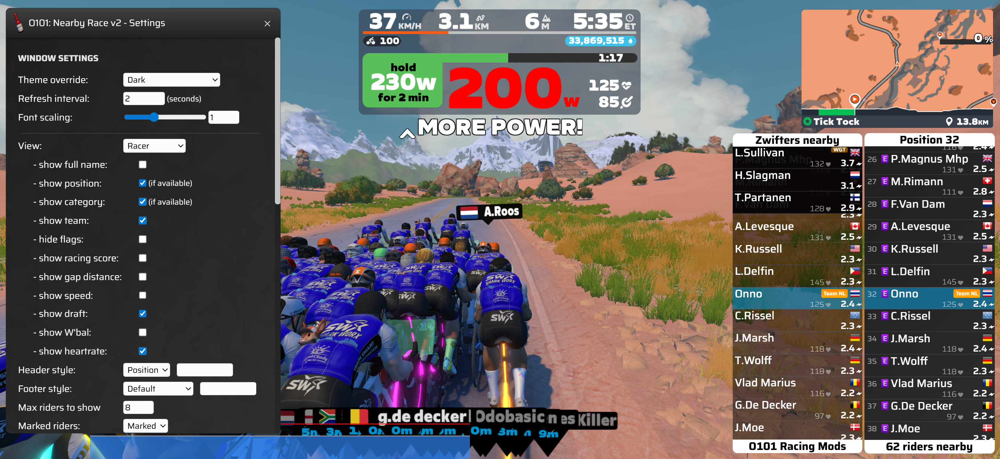

Onno's racing MODS, for Sauce for Zwift™
===========

# Table of Contents
- [Nearby Race v2](#nearby-race-v2)
- [Groups Race](#groups-race)
- [Ladder Race](#ladder-race)
- [Overview](#overview)
- [Livedata](#livedata)
- [Progress Bar](#progress-bar)
- [Fan Viewer](#fan-viewer)

## Nearby Race-v2

The nearby race v2 mod window is the default Zwift nearby riders on steroids. You can overlay the default Zwift nearby window or in no-HUD have it on your desired position.

It has a lot of options so you can tailor it to your needs. Best is to find out yourself. Fan viewing a pace partner or a race and try out what each option does.

To have a quick start, I'll explain some options, skipping those that are or should be self-explaining.

**Rider names**: These are filtered to have clean names. It can be different from default Zwift nearby.

**Wkg**: At the right side you can see the Wkg a rider is pushing. Default text color is white. It's colored when power is above a certain amount.
- 5 Wkg => orange
- 8 Wkg => red
- 11 Wkg => purple

**View**: Choose this one to start. I only race, so most options are related for racing.

**Show position**: Displays position in front of the name. Position is as known at Zwift servers, so can differ to default Zwift nearby.

**Show team**: Shows team name as a badge next to the name. Team name is derived from the Zwift name. For example, my Zwift name "O. Aphinan (CLOUD)" will be translated into O.Aphinan and a nice colored team badge named CLOUD. Some most used teams have predefined colors. If you want your team have the right color, let me know.

**Max riders to show**: The number of riders to show in the nearby list. 4 means 2x4 riders and having you centered if possible. It can also be 8 and you at the back. For low end hardware don't use more than needed.

**Marked riders**: "Marked" will have the marked rider visible with a star icon in front and different background. They will only show if nearby close to your position. "Sticky" will have the marked riders always visible. It can be on top, or at the bottom of the nearby window. "Only" will filter out all other riders, also no star icon or different background.

**Show robopacers/leader/sweaper**: Have them always visible / sticky on top or bottom of the nearby window. Same as sticky marked riders. Great for group rides or robopacer rides to know where they are.

**My category only**: Filters out other start pens.

**Refresh on attack**: Having a fast refresh interval changes the nearby riders a lot. You can have that one refreshing slow. But you want to know when someone attacks or starts sprinting at the finish. You can use this setting, and it will update the nearby riders as soon as there's new data available. Asap can vary between 400ms or 1500ms, depends on the Sauce framework.

**Name overrides**: For team racing or something else (whatever you can think of) Some teammates can't type, resulting in a messy name and or different team badge. Lookup their Zwift id and override name and team badge.

**Flamme Rouge Racing**: For the FRR races the category is mandatory, FHRC badge. To easily see a rider's FHRC badge you can use this. As all FHRC badges have a reddish colour, you can customize your own category badge and easily distinguish it.

**Tips & Tricks**
- You can have multiple Nearby Race v2 windows. For example, the default and next to that a window of your teammates and/or rivals. Also great for mixed cat or FRR races, see all nearby and your own category.
- You can zoom in or out using ctrl and + or - keys.
- For TTT's use marked riders only and name overrides with number prefix.

## Groups Race

## Ladder Race

## Overview

## Livedata

## Progress Bar

## Fan Viewer